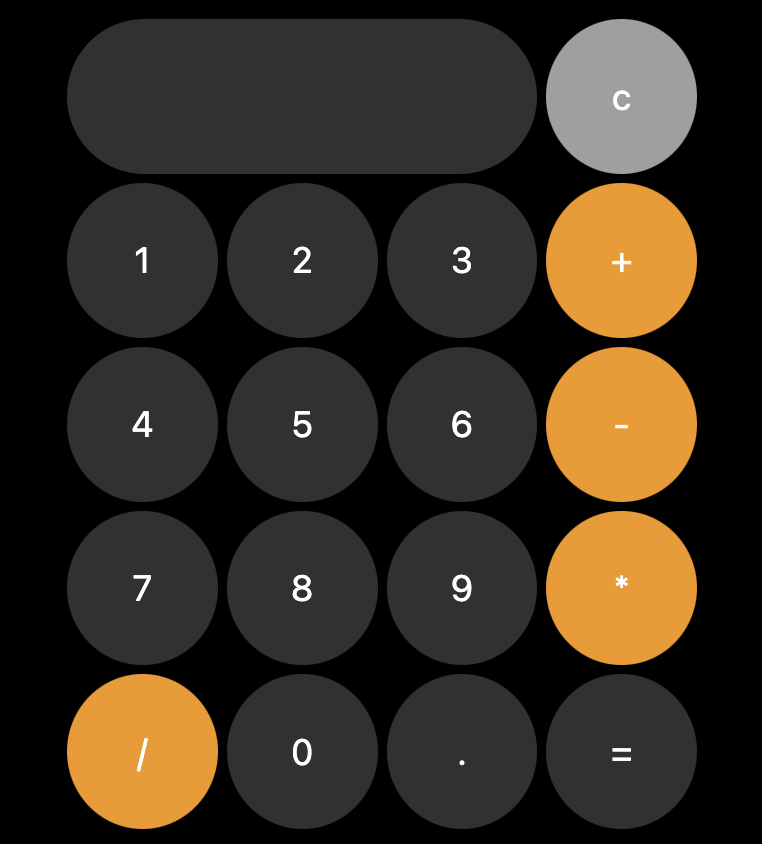

# Calculator 
A calculator that does some calculations



## Setup
1. Clone this repo and go to the cloned folder.
``` sh
$> https://github.com/cvine21/calculator.git && cd calculator
```
2. Run the index.html file with your favourite browser.
